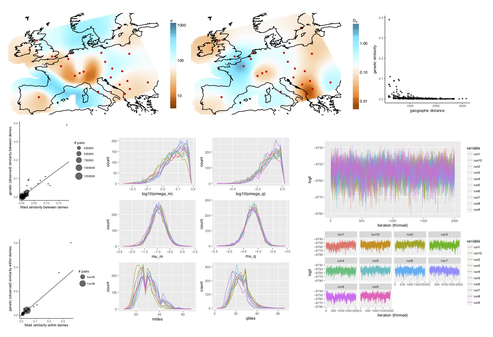

# plotmaps

An R-package for plotting the output of the [MAPS software](https://github.com/halasadi/MAPS).




# Installation

```
git clone https://github.com/halasadi/plotmaps.git
install.packages("devtools")
library(devtools)
install(path-to-plotmaps/plotmaps)
```

## License

Copyright (c) 2017-2018, Hussein Al-Asadi.

The software and example programs in this repository are made
available under the terms of the
[MIT license](https://opensource.org/licenses/mit-license.html).
See [LICENSE](LICENSE) for the full text of the license.

## Credits

This software was developed by
[Hussein Al-Asadi](https://github.com/halasadi) at the University of
Chicago.

`plotmaps` is adapted from the [EEMS](https://github.com/dipetkov/eems/tree/master/plotting) package and Ben Peter's [plotting scripts](https://github.com/BenjaminPeter/eems-around-the-world-draft/tree/master/scripts).
